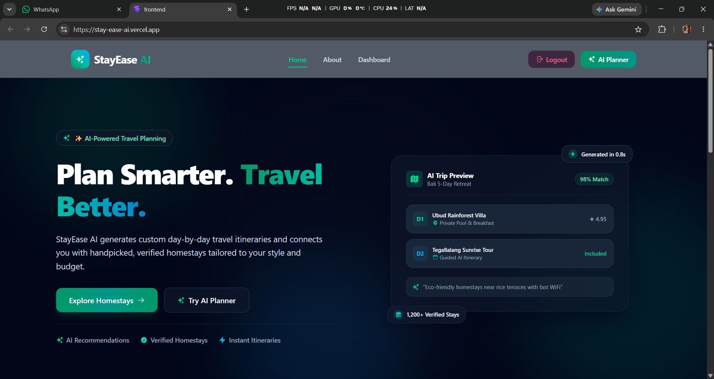
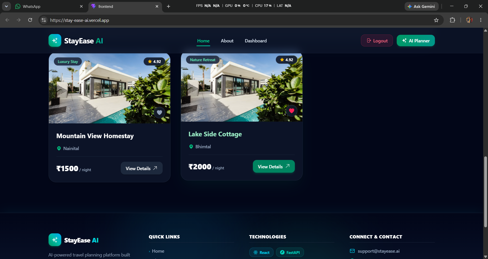
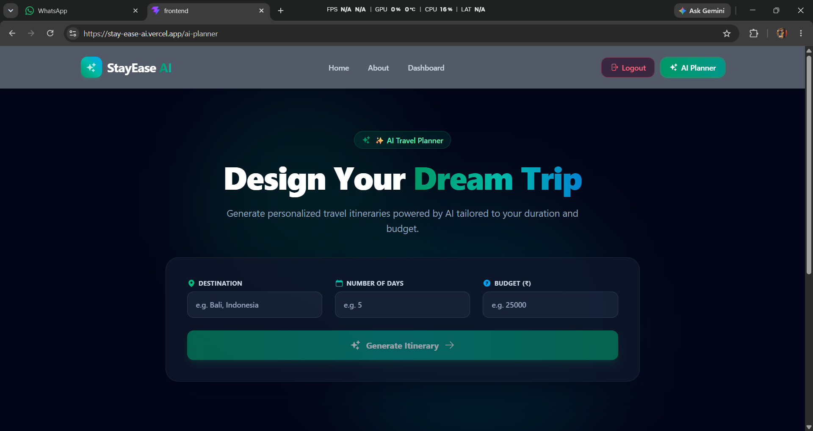
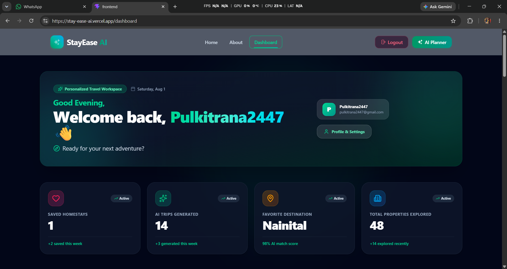
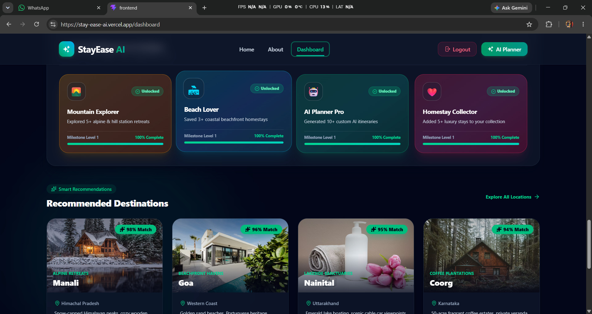
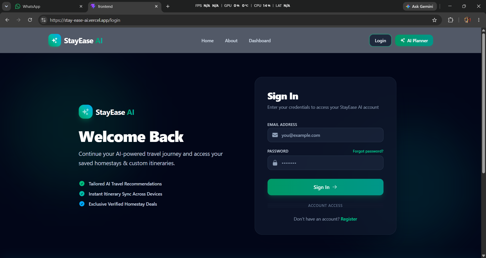
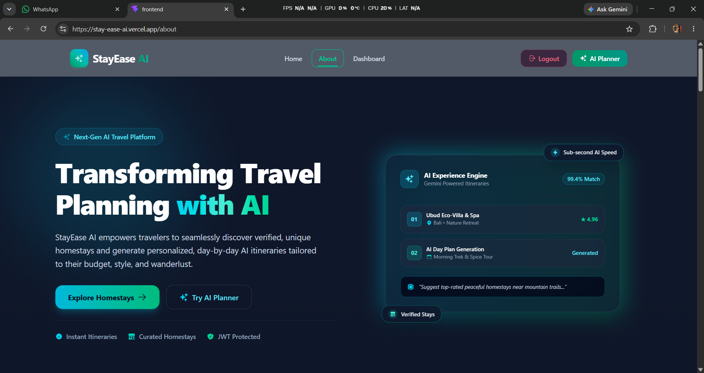
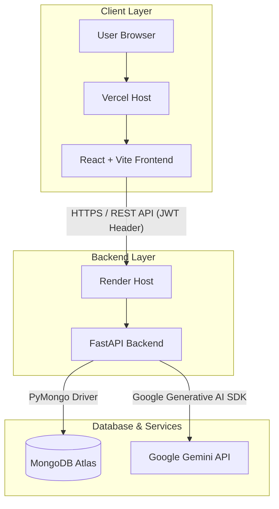

# 🏡 StayEase AI

StayEase AI is a full-stack web application that combines homestay discovery with AI-powered personalized travel planning, delivering customized travel itineraries and curated accommodations.


---

## 🌐 Live Demo

- **Live Application:** [https://stay-ease-ai.vercel.app](https://stay-ease-ai.vercel.app)
- **Backend API:** [https://stayease-ai-backend.onrender.com](https://stayease-ai-backend.onrender.com)
- **API Documentation:** [https://stayease-ai-backend.onrender.com/docs](https://stayease-ai-backend.onrender.com/docs)

> ℹ️ **Note:** The backend is deployed on Render's free tier. If the service has been idle, the initial API request may experience a short cold-start delay (20–40 seconds) while the instance spins up.

---

## 📋 Project Overview

Modern travelers often struggle to coordinate accommodation search with day-by-day travel planning. StayEase AI unifies homestay discovery and travel itinerary generation into a single workspace.

### Core Capabilities
- **Explore & Filter Homestays:** Browse curated stays by category (Nature & Eco Villa, Mountain Retreat, Beachfront Villa, Luxury Plantation, Heritage Palace, Hilltop Sanctuary), search by name, or filter by price range and location.
- **Detailed Property Pages:** View interactive photo mosaic galleries, detailed descriptions, category-grouped amenities, nearby landmarks with travel time estimates, verified guest reviews, sticky pricing cards, and similar property recommendations.
- **AI-Powered Itinerary Generation:** Input destination, duration (days), and budget (INR) to generate personalized day-by-day itineraries using Google Gemini AI.
- **Guest vs. Authenticated Behavior:**
  - **Guests:** Can freely browse homestays, filter properties, view details, and generate AI travel itineraries without logging in.
  - **Authenticated Users:** Can save favorite homestays to their MongoDB profile, persist generated AI itineraries, view saved trips in their personal workspace, and delete unwanted itineraries.

---

## ✨ Key Features

### 🏡 Homestay Discovery
- **Property Directory & Search:** Live regex-backed search and category filtering for homestays.
- **Interactive Gallery:** Multi-photo mosaic view with preview lightboxes.
- **Sticky Booking Card:** Dynamic stay pricing calculations based on selected guest counts and stay duration.
- **Rich Details:** Categorized amenities (WiFi, Mountain View, Breakfast, Pool, Workspace), nearby attractions with distance estimates, guest review breakdowns, and recommended similar stays.

### 🤖 AI Trip Planner
- **Customized Inputs:** Specify destination name, trip duration (number of days), and total budget in INR.
- **Gemini Integration:** Powered by Google's `gemini-2.5-flash` model to return structured day-by-day schedules, recommended activities (morning, afternoon, evening), and practical travel tips.
- **Auto-Save & Manual Persistence:** Authenticated users can save generated itineraries directly to their account database with a single click.

### 🔐 Authentication & Security
- **Registration & Login:** Secure account creation and login endpoints (`/api/auth/register` and `/api/auth/login`).
- **Password Hashing:** Passwords hashed using `bcrypt` before database storage.
- **JWT Authorization:** Stateless authentication using JSON Web Tokens passed via HTTP `Authorization: Bearer <token>` headers.
- **Protected Client Routes:** Frontend `ProtectedRoute` wrapper guarding private pages (`/dashboard`, `/profile`).

### ❤️ Favorites
- **Database Persistence:** Favorites stored in MongoDB (`favorites` collection) keyed by user email and homestay ID.
- **Real-Time Context Sync:** Global React Context (`FavoritesContext`) updating UI state across cards and detail pages.

### 📊 User Dashboard
- **Personalized Greeting:** Dynamic time-based welcome message (Good Morning / Afternoon / Evening) displaying authenticated user email.
- **Saved Favorites:** Dedicated section rendering saved homestay cards with quick removal actions.
- **Recent AI Trips:** Fetch and display all persisted itineraries saved by the user, complete with detailed viewing modals and deletion controls.
- **User Activity & Presentational Widgets:** Includes presentational stats cards (Saved Stays, AI Trips, Explored Stays), travel achievement badges, activity timeline, and recommended destinations.

### 🔔 Notification UX
- Toast notification feedback powered by `react-hot-toast` for login events, bookmark additions/removals, itinerary saves, deletion confirmations, and network errors.

### 📱 Responsive UI
- Styled with modern dark glassmorphism aesthetic, responsive Tailwind CSS grid layouts, mobile drawer menu navigation, and fluid Framer Motion enter/exit animations.

---

## 🖼️ Screenshots

### 🏡 Homepage & Discovery
| Hero & Search Bar | Homestay Listings Grid |
| :---: | :---: |
|  |  |

### 🤖 AI Trip Planner & User Dashboard
| AI Itinerary Generator | Personal Travel Workspace |
| :---: | :---: |
|  |  |

### 🏠 Homestay Details, Authentication & About
| Homestay Details & Gallery | User Login |
| :---: | :---: |
|  |  |

| About StayEase AI |
| :---: |
|  |

---

## 🏗️ System Architecture



---

## 📁 Project Structure

```text
StayEase-AI/
├── backend/
│   ├── database.py              # MongoDB Atlas connection setup
│   ├── main.py                  # FastAPI server routes & auth logic
│   ├── models.py                # Pydantic schemas (User, Travel, Itinerary)
│   ├── Procfile                 # Deployment process command for Render/Heroku
│   ├── render.yaml              # Render deployment configuration
│   └── requirements.txt         # Python dependencies
├── frontend/
│   ├── public/                  # Static icons & favicons
│   ├── screenshots/             # Application screenshots
│   ├── src/
│   │   ├── components/          # Reusable UI components
│   │   │   ├── dashboard/       # Dashboard widgets (Stats, Trips, Favorites)
│   │   │   ├── homestay/        # Homestay details sub-components
│   │   │   ├── ui/              # Skeletons and loading indicators
│   │   │   ├── AIItineraryViewer.jsx
│   │   │   ├── Card.jsx
│   │   │   ├── Footer.jsx
│   │   │   ├── Hero.jsx
│   │   │   ├── Navbar.jsx
│   │   │   ├── ProtectedRoute.jsx
│   │   │   └── SearchFilterBar.jsx
│   │   ├── config/
│   │   │   └── api.js           # API base URL export
│   │   ├── context/
│   │   │   └── FavoritesContext.jsx
│   │   ├── pages/               # Application routes (Home, AIPlanner, Dashboard, etc.)
│   │   ├── App.jsx              # Main router & toast configuration
│   │   ├── index.css            # Tailwind CSS directives & custom utility classes
│   │   └── main.jsx             # React entry point
│   ├── index.html
│   ├── package.json
│   ├── vercel.json              # Vercel SPA rewrite rule
│   └── vite.config.js
├── PROMPTS.md                   # Prompts used for AI generation
└── README.md                    # Project documentation
```

---

## 🔌 API Endpoints

| Method | Endpoint | Description | Auth Required |
| :---: | :--- | :--- | :---: |
| `GET` | `/` | Health check endpoint | ❌ No |
| `GET` | `/homestays` | Retrieve list of all available homestays | ❌ No |
| `GET` | `/homestays/{homestay_id}` | Retrieve details for a specific homestay by ID | ❌ No |
| `POST` | `/homestays` | Add a new homestay entry | ❌ No |
| `PUT` | `/homestays/{homestay_id}` | Update an existing homestay entry | ❌ No |
| `DELETE` | `/homestays/{homestay_id}` | Delete a homestay entry | ❌ No |
| `GET` | `/search?name={query}` | Search homestays by name using regex | ❌ No |
| `POST` | `/api/auth/register` | Register a new user account | ❌ No |
| `POST` | `/api/auth/login` | Authenticate user & return JWT token | ❌ No |
| `GET` | `/api/profile` | Fetch authenticated user profile details | ✅ Yes |
| `POST` | `/api/ai/itinerary` | Generate AI travel itinerary via Gemini API | ❌ No |
| `GET` | `/api/favorites` | Retrieve user's favorite homestay IDs | ✅ Yes |
| `POST` | `/api/favorites/{homestay_id}` | Add homestay ID to user's favorites | ✅ Yes |
| `DELETE` | `/api/favorites/{homestay_id}` | Remove homestay ID from user's favorites | ✅ Yes |
| `GET` | `/api/itineraries` | Retrieve all saved AI itineraries for user | ✅ Yes |
| `POST` | `/api/itineraries` | Persist a generated AI itinerary to database | ✅ Yes |
| `DELETE` | `/api/itineraries/{itinerary_id}` | Delete a saved AI itinerary | ✅ Yes |

---

## 💻 Local Development

### Prerequisites
- **Node.js** (v18+)
- **Python** (v3.10+)
- **MongoDB Atlas** database cluster (or local MongoDB server)
- **Google Gemini API Key**

---

### Backend Setup

1. Navigate to the `backend` directory:
   ```cmd
   cd backend
   ```

2. Create a Python virtual environment:
   ```cmd
   python -m venv venv
   ```

3. Activate the virtual environment:
   - **Windows (Command Prompt / PowerShell):**
     ```cmd
     venv\Scripts\activate
     ```
   - **macOS / Linux:**
     ```bash
     source venv/bin/activate
     ```

4. Install backend dependencies:
   ```cmd
   pip install -r requirements.txt
   ```

5. Create a `.env` file in `backend/` using the environment variables listed below.

6. Start the FastAPI server:
   ```cmd
   uvicorn main:app --reload --port 8000
   ```
   The API server will run at `http://127.0.0.1:8000`. Interactive OpenAPI documentation is available at `http://127.0.0.1:8000/docs`.

---

### Frontend Setup

1. Open a new terminal and navigate to the `frontend` directory:
   ```cmd
   cd frontend
   ```

2. Install dependencies:
   ```cmd
   npm install
   ```

3. Create a `.env` file in `frontend/` using the environment variables listed below.

4. Start the Vite development server:
   ```cmd
   npm run dev
   ```
   The frontend application will be available at `http://localhost:5173`.

---

## 🔐 Environment Variables

### Backend `.env` (`backend/.env`)

```env
APP_NAME=StayEaseAI
DEBUG=True
MONGO_URI=mongodb+srv://<username>:<password>@cluster0.mongodb.net/stayease?retryWrites=true&w=majority
JWT_SECRET=your_jwt_secret_key_here
GEMINI_API_KEY=your_google_gemini_api_key_here
ALLOWED_ORIGINS=http://localhost:5173,http://127.0.0.1:5173,https://stay-ease-ai.vercel.app
PORT=8000
```

### Frontend `.env` (`frontend/.env`)

```env
VITE_API_URL=http://127.0.0.1:8000
```

> ⚠️ **Important:** Never commit actual `.env` files containing real database credentials, API keys, or JWT secrets to version control.

---

## 🚀 Deployment

- **Frontend (Vercel):** Deployed as a static React single-page application. `frontend/vercel.json` includes fallback rewrites (`/(.*)` -> `/index.html`) to support client-side React Router navigation. `VITE_API_URL` environment variable points to the production Render backend URL.
- **Backend (Render):** Deployed as a Web Service running Uvicorn ASGI server. Configured via `backend/render.yaml` and `backend/Procfile`.
- **Database (MongoDB Atlas):** Hosted cloud MongoDB cluster storing users, favorites, homestays, and itineraries collections.
- **AI Integration (Google Gemini API):** Interfaced using the `google-generativeai` SDK with `gemini-2.5-flash`.

---

## 🛡️ Security Practices

- **Password Encryption:** User passwords hashed using `bcrypt` before persistence.
- **Stateless Authorization:** Secure JWT access tokens signed with server secret key.
- **Protected Client Routes:** React Router guarded by `ProtectedRoute` checking token availability.
- **Protected Backend API Routes:** Endpoints verifying JWT headers via `verify_token` dependency before accessing MongoDB documents.
- **Controlled CORS:** Middleware strictly handling request origins from permitted development and production hostnames.

---

## 🔮 Future Improvements

- **Interactive Maps:** Integration with Leaflet/Mapbox for geographical property visualization.
- **Booking & Payment Integration:** Payment gateway integration (Stripe / Razorpay) for direct reservation checkouts.
- **Export Itineraries to PDF:** Ability to export generated travel itineraries into formatted PDF downloads.
- **Password Reset & Email Verification:** Email notifications for account registration and password recovery.
- **Host Dashboard:** Dedicated portal for property owners to list, edit, and manage homestays.

---

## 👨‍💻 Author

**Pulkit Rana**  
GitHub Repository: [https://github.com/ghost0547/StayEase-AI](https://github.com/ghost0547/StayEase-AI)
